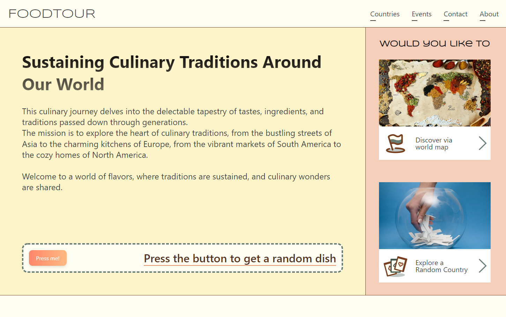
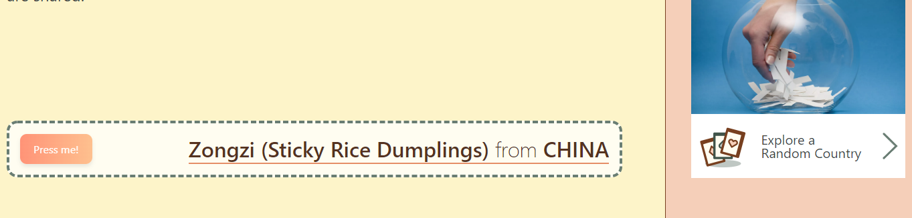
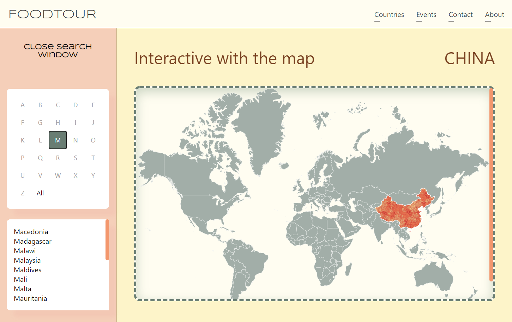
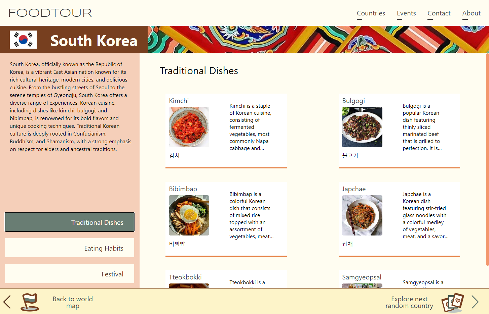

# FoodTour: Reconnecting with Culinary Traditions

## Project Introduction

### Overview

FoodTour is a digital guide designed to rekindle connections with cultural culinary traditions around the world. It explores traditional dishes, customs, and stories, celebrating the cultural significance of cuisine.

Key highlights include:

-   Exploring traditional dishes from diverse cultures.
-   Diving into the customs and stories surrounding culinary traditions.
-   Strengthening the link between individuals and their cultural roots through food.
    
    Landing page of FoodTour

### Functionalities

-   **Random Country and Dish Selection:** Discover a traditional dish from a randomly selected country, or jump to a suprising country.
    
-   **Interactive World Map:** Select a country to explore, either by searching or interacting with the world map.
    

-   **Food Information of Countries:** Discover eating habits, traditional dishes, and festivals of different countries.
    
-   **Events:** Explore food-related events happening in the Sydney area.

## Hardware and Software Requirements

### Hardware

-   Computer with Windows, macOS, or Linux.
-   Dual-core processor or higher.
-   Minimum 4 GB RAM recommended.
-   Adequate storage space for project files and browser cache (at least 3 GB).

### Software

-   Modern web browser (e.g., Google Chrome, Mozilla Firefox, Microsoft Edge, or Safari).
-   JavaScript enabled in the browser.
-   Git for cloning the GitHub repository.
-   Node.js for running the React application.

## Setup Instructions

1. **Install Necessary Software:**

    - **Git:** Install Git to be able to clone the GitHub repository. You can download the Git installer for your operating system from the [Git official website](https://git-scm.com/downloads) and follow the installation instructions.

    - **Node.js:** Install Node.js to run the React application. You can download the Node.js installer for your operating system from the [Node.js official website](https://nodejs.org/en).

2. **Clone the GitHub Repository:**

    - Open a terminal or command prompt window.
      <br>On a Mac, press `Command + Space`, then type `Terminal` and press Enter.
      <br>On Windows, press `Windows key + R`, then type `cmd` and press Enter.
    - Navigate to the directory where you want to store the project. For example, to enter your home directory, you can execute:

        ```bash
        cd ~
        ```

    - Use the following command to clone the GitHub repository:

        ```bash
        git clone https://github.com/Xinxuan-Li/DECO3200-A4.git
        ```

        This will download the code from the GitHub repository to your local computer.

3. **Navigate to the Project Directory:**

    - Use the `cd DECO3200-A4` command to enter the project directory.

        ```bash
        cd DECO3200-A4
        ```

4. **Install Project Dependencies:**

    - After entering the project directory, run the following command to install the dependencies required for the project:

        ```bash
        npm i
        ```

        This will install the necessary packages for the project.

5. **Run the React Application:**

    - Once the dependencies are installed, you can use the following command to run the React application locally:

        ```bash
        npm run dev
        ```

        The application will start and open in your web browser. You can access the application in the browser to see it in action.

## Additional Details

### Tech Stack

In our project, we have utilized the following technology stack to build and develop the web application:

-   **Front-end Framework:** [React](https://reactjs.org)
-   **Build Tool:** [Vite](https://vitejs.dev)
-   **Styling:** CSS

### Developers and Contact

-   **Erica Hu:** [lyhuxinyi@gmail.com](mailto:lyhuxinyi@gamil.com)
-   **Xinxuan Li:** [xinxuanli1030@gmail.com](mailto:xinxuanli1030@gmail.com)
-   **Gabin Hong:** [ghon0206@uni.sydney.edu.au](mailto:ghon0206@uni.sydney.edu.au)

## Reference

-   Jen Cardello. 2014. Define Stronger A/B Test Variations Through UX Research. Retrieved from: https://www.nngroup.com/articles/ab-testing-and-ux-research/

-   Nielsen, J. (1992). Finding usability problems through heuristic evaluation. CHI. https://doi.org/10.1145/142750.142834

-   Artem K. (n.d.). Design Library 2023 | Auto Layout, Styles, Variables. Figma Community. https://www.figma.com/community/file/1278645552292083735

-   Cullen, D. (2016, September 4). Pork Chops in Salsa Verde Recipe [Video]. https://mexicanfoodjournal.com/chiles-en-nogada/

-   Curly drawn orange pattern Free Vector. (2015, October 21). Freepik. https://www.freepik.com/free-vector/curly-drawn-orange-pattern_819590.htm#query=chinese%20pattern&position=45&from_view=keyword&track=ais

-   Kalypso Designs. (n.d.). Flipping cards Interaction. Figma Community. https://www.figma.com/community/file/1143841546353381555

-   Limited, A. (n.d.). Mexican folk art seamless vector pattern, colourful design with flowers wallpaper inspired by traditional designs from Mexico. Alamy Images. https://www.alamy.com/mexican-folk-art-seamless-vector-pattern-colorful-design-with-flowers-wallpaper-inspired-by-traditional-designs-from-mexico-image178723951.html

-   Lkeskinen. (n.d.). Ancient Iceland pattern seamless design vector image. VectorStock. https://www.vectorstock.com/royalty-free-vector/ancient-iceland-pattern-seamless-design-vector-26775983

-   Mariana. (2023). Traditional Food of Mexico: Top 20 Dishes. Vibe Adventures. https://vibeadventures.com/traditional-food-of-mexico-top-20-dishes/

-   MTCorp’s team. (n.d.). Figma | World Map. Figma Community. https://www.figma.com/community/file/1088880922172937471

-   Pandey, S. (2023, January 16). 11 Mexican Festivals That Are A Must-Attend For Everyone In 2023. https://traveltriangle.com/blog/mexican-festivals/

-   Quintero-Angel, M., Mendoza, D. M., & Girón, J. M. (2022). Food fears and risk of loss of food heritage: A little-explored effect of food modernity and times of pandemic. International Journal of Gastronomy and Food Science, 28, 100499. https://doi.org/10.1016/j.ijgfs.2022.100499

-   Malkani, M. (n.d.). Seamless traditional Indian paisley pattern. 123RF. https://www.123rf.com/photo_90808585_seamless-traditional-indian-paisley-pattern.html

-   Pattern | French style. (n.d.). Pinterest. https://www.pinterest.com/AmiaWang/pattern-french-style/

-   Pngtree. (n.d.). Thai Traditional art baroque pattern tile background. https://pngtree.com/freebackground/thai-traditional-art-baroque-pattern-tile-background_1910706.html
